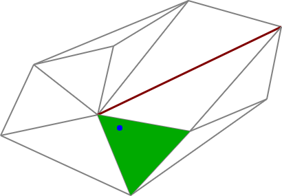

Containing Triangle
===================

Find the triangle of a [Delaunator](https://github.com/mapbox/delaunator)
triangulation that contains a given point.

Example
-------

	// Points to be triangulated
	const points = [[53,98],[5,201],[194,288],[280,195],[392,148],[413,43],[278,5],[169,71],[146,171]],
		// Edges to be constrained (optional)
		edges = [[5, 8]],
		// Triangulate
		del = Delaunator.from(points),
		// (Optional: constrain the triangulation)
		con = new Constrainautor(del).constrainAll(edges),
		// Find the triangle that contains the point (178, 190)
		tri = containingTriangle(del, 178, 190);
	
	// tri has triangle id: 3

Install
-------

Install from NPM:

	npm install @kninnug/containing-triangle
	
Use in Node.js:

	const containingTriangle = require('@kninnug/containing-triangle'),
		isInTriangulation = containingTriangle.isInTriangulation;
	
or as an ECMAScript/ES6 module:

	import containingTriangle, {isInTriangulation} from '@kninnug/containing-triangle';

or in the browser:

	

or minified:

	

The containing-triangle library does not depend on Delaunator itself, but the
input is expected to be in the format that Delaunator outputs. The ES module
variant (`containing-triangle.mjs`) depends on [robust-predicates](https://www.npmjs.com/package/robust-predicates),
but the browser and minified versions (`containing-triangle.js` and
`containing-triangle.min.js`) come with this dependency compiled in, and can be
used standalone.

Usage
-----

### containingTriangle(del, x, y)

Given a triangulation from Delaunator: `del`, and the coordinates of a point
(`x`, `y`), finds the triangle that contains that point. Returns the [triangle
id](https://mapbox.github.io/delaunator/#edge-and-triangle), or -1 if the point
is outside the hull of the triangulation, i.e. not in any of its triangles.

### isInTriangulation(del, x, y)

Whether a point (`x`, `y`) is within the hull of the given triangulation. Should
generally be faster if you only want to know if the point is in the
triangulation and don't care what triangle it's in.

Attributions
------------

- The algorithm is adapted from "A robust efficient algorithm for point location
  in triangulations", February 1997, Peter J.C. Brown, Christopher T. Faigle
- Uses Vladimir Agafonkin's [robust-predicates](https://github.com/mourner/robust-predicates) port
  of Jonathan Shewchuk's [Adaptive Precision Floating-Point Arithmetic and Fast Robust Predicates
  for Computational Geometry](http://www.cs.cmu.edu/~quake/robust.html).
- Nearest point on segment code adapted from [Joshua on StackOverflow](https://stackoverflow.com/a/6853926).
